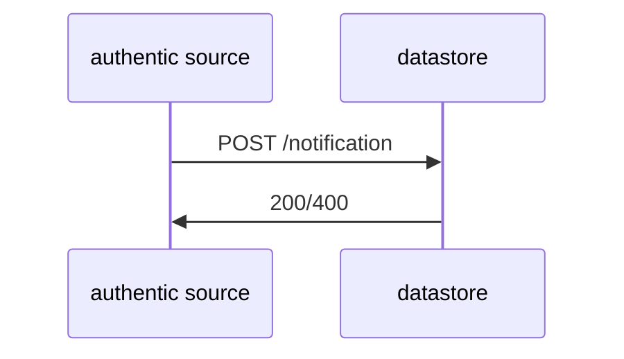

# Flowchart

## Upload document to datastore




## Fetch a credential

```mermaid
    sequenceDiagram;
    wallet->>satosa;
    satosa->>apigw;
    apigw->>issuer;
    issuer->>apigw;
    apigw->>satosa;
    satosa->>wallet;
```
