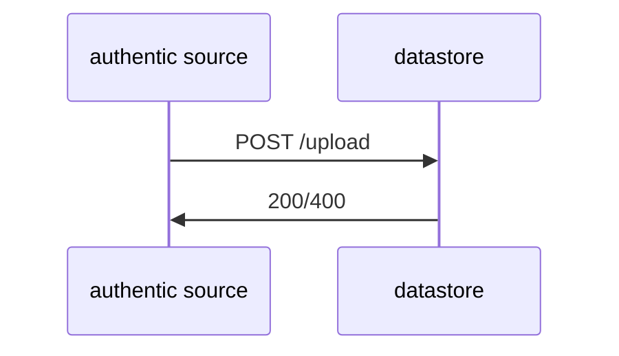
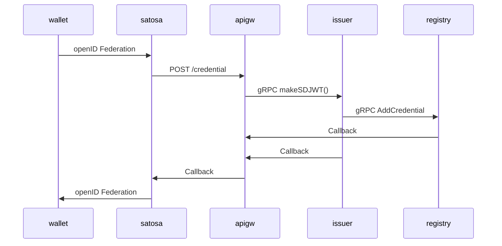
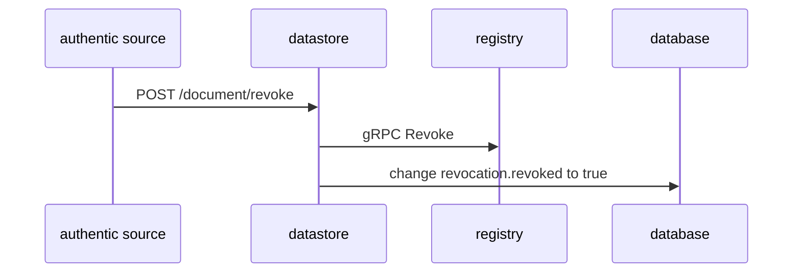

# Flowchart

## Upload document to datastore

```mermaid
    sequenceDiagram;
    authentic source->>datastore: POST /upload;
    datastore->>authentic source: 200/400 ;
```

## Fetch credential

```mermaid
    sequenceDiagram;
    wallet->>satosa: openID Federation;
    satosa->>apigw: POST /credential;
    apigw->>issuer: gRPC makeSDJWT();
    issuer->>registry: gRPC AddCredential
    registry->>apigw: Callback;
    issuer->>apigw: Callback;
    apigw->>satosa: Callback;
    satosa->>wallet: openID Federation;
```

## Revoke credential

```mermaid
    sequenceDiagram;
    authentic source->>datastore: POST /document/revoke;
    datastore->>registry: gRPC Revoke;
    datastore->>database: change revocation.revoked to true
```
