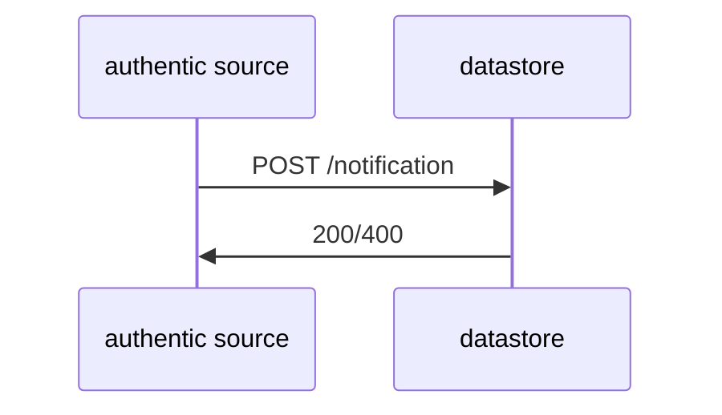

# Flowchart

## Upload document to datastore




## Fetch a credential

```mermaid
    sequenceDiagram;
    wallet->>satosa: openID Federation;
    satosa->>apigw: POST /credential;
    apigw->>issuer: gRPC makeSDJWT();
    issuer->>apigw: Callback;
    apigw->>satosa: Callback;
    satosa->>wallet openID Federation;
```
